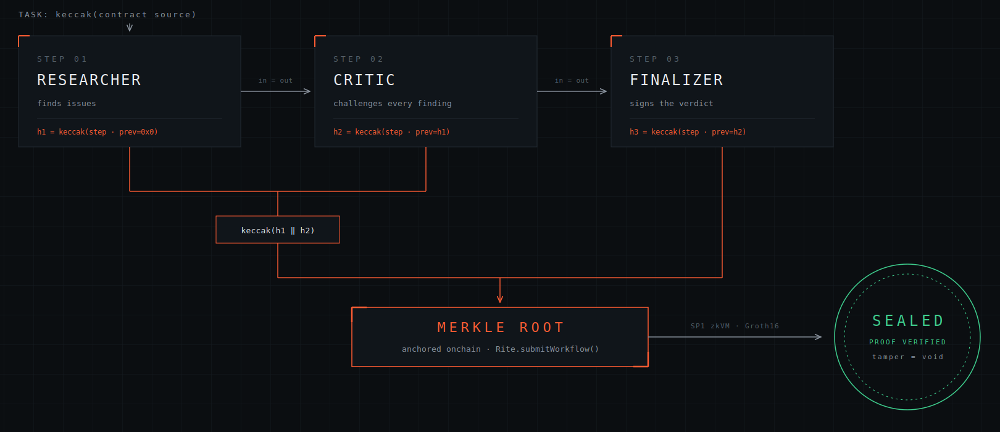

# Rite

Rite records ordered contract-review work as Merkle commitments on Ritual Chain.

The system produces a deterministic three-step trail, creates an OpenZeppelin-compatible sorted-pair Merkle root, and lets the user commit that root with their own wallet. A verifier can later check any step locally and against the onchain root.



## Run locally

```bash
npm install
cp .env.example .env.local
npm run dev
```

Open `http://localhost:3000`, paste a Solidity fragment and create an audit record. Local development writes to `data/workflows.json` unless Upstash Redis env vars are present.

## Contract configuration

Deploy `Rite.sol` to Ritual, then set:

```bash
NEXT_PUBLIC_CHAIN_ID=1979
NEXT_PUBLIC_RITE_ADDRESS=0xYourRiteContract
NEXT_PUBLIC_RITUAL_RPC_URL=https://rpc.ritualfoundation.org
NEXT_PUBLIC_RITUAL_EXPLORER_URL=https://explorer.ritualfoundation.org
RITUAL_RPC_URL=https://rpc.ritualfoundation.org
RITUAL_EXPLORER_URL=https://explorer.ritualfoundation.org
RITE_ADDRESS=0xYourRiteContract
```

`submitWorkflow` is signed by the connected browser wallet. The production application does not operate a server signer.

After a wallet commit, Rite records the transaction receipt in storage: signer, transaction hash, chain status, chain id and block number. Other visitors opening the workflow link can see the sealed state and follow the explorer links.

## Vercel storage

Vercel serverless functions cannot use `data/workflows.json` as durable storage. Install Upstash KV from the Vercel Marketplace or set these variables before production deploy:

```bash
KV_REST_API_URL=
KV_REST_API_TOKEN=
```

## API

| Method | Route | Purpose |
| --- | --- | --- |
| `GET` | `/api/workflows` | List workflow receipts |
| `POST` | `/api/workflows` | Create a deterministic audit trail |
| `GET` | `/api/workflows/:id` | Read a receipt with proofs |
| `POST` | `/api/workflows/:id/verify-step` | Verify a step locally and optionally on Ritual |

## Deployment

Verify the deployed contract's `submitWorkflow` and `verifyStep` signatures against `lib/rite-abi.ts`, set the public contract address, set Upstash Redis env vars, and run:

```bash
npm run typecheck
npm run build
```
